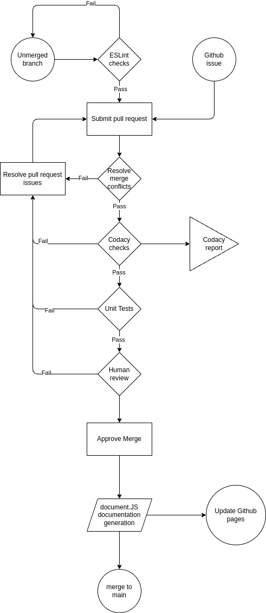

# CI/CD Pipeline 
## 1. Linting (ESLint)
We used ESLint for implementing Linting and checking for code style enforcement. Everything is working successfully such as checking for folder and function names, prevents duplicate functions, and checks general formatting of the code as well.
  
In progress:
- In order to further integrate ESLint we require more tests and codes to be written

## 2. Code quality via Codacy 
Codacy is an external website that allows us to add our Github repository and runs checks against the files in it to detect potential security breaches or error-prone code on various levels. We have added it so that Codacy checks are run every time during a pull request. 
  
In progress:
- To add Codacy to the workflow completely for generating code coverage reports, we are required to add coverage tests that have yet to be implemented in our repository, but is planned to be done
- Codacy also signals that our main branch is not protected; however to enforce the branch protection rule we require an upgrade to our team repository to either Github Team or an Enterprise Account.

## 3. Code quality via Pull Requests
Branch protection ruleset, where we enabled the feature that at least one person is required to review the code and approve it for a pull request before merging. 
  
In progress:
- It’s not exactly working so we also added additional protection where the code reviewer cannot be the coder to accept merge/pull requests. But as stated above in order to enforce the branch protection rule we require an upgrade to our repository.

## 4. Documentation generation via automation (JSDocs)
Instead of JSDocs, we used documentation.JS for generating documentation in a separate file. It successfully generates the document given corresponding code.
  
To be done:
- Since it requires the exact the location/directory of the js files that it will be generating documentation from, we will specify the backends folder which is expected to hold our future js codes for the project, and the documentation will be generated off of that.

# Diagram of Pipeline
