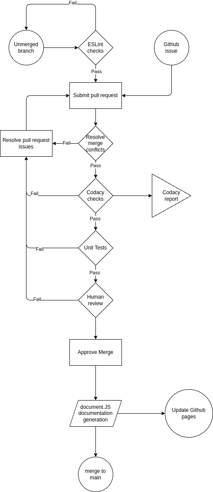

# CI/CD Pipeline PHASE 2
## 1. Linting (ESLint)
We used ESLint for implementing Linting and checking for code style enforcement. Everything is working successfully such as checking for folder and function names, prevents duplicate functions, and checks general formatting of the code as well.
  

## 2. Code quality via Codacy 
Codacy is an external website that allows us to add our Github repository and runs checks against the files in it to detect potential security breaches or error-prone code on various levels. We have added it so that Codacy checks are run every time during a pull request. 
  
Potential Issue: Free Trial limit

## 3. Code quality via Pull Requests
Branch protection ruleset, where we enabled the feature that at least one person is required to review the code and approve it for a pull request before merging. 
  

## 4. Documentation generation via automation (JSDocs)
Instead of JSDocs, we used documentation.JS for generating documentation in a separate file. It successfully generates the document given corresponding code.
  

## 5. Unit Tests via Jest
We have created successfully working and passing unit tests, and our pipeline will run these tests via jest by pointing to the `__tests__`. 
  

# Diagram of Pipeline
