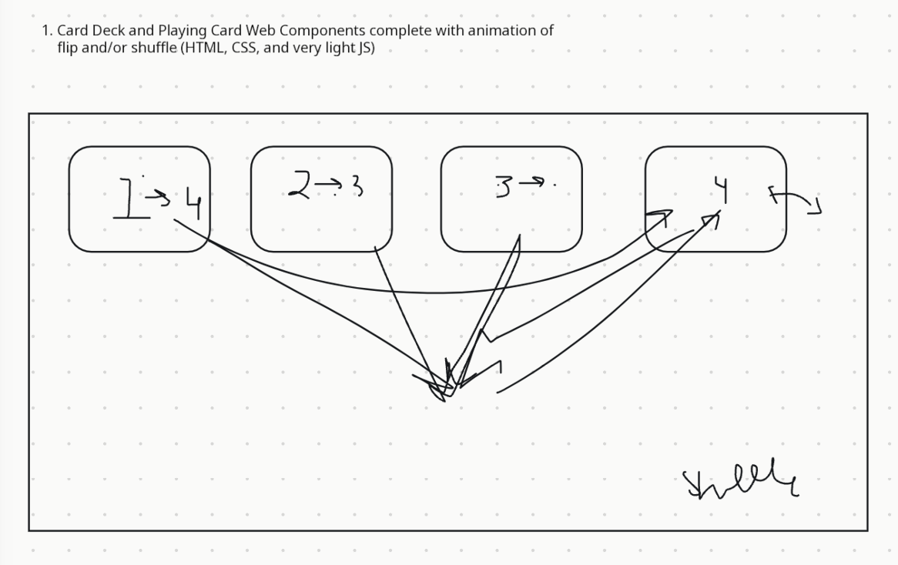

# April 16 notes

## Agenda:
- 3:00 - Start meeting
- 3:05 - Planning

## Attendance:
- Albert
- Prachi
- Charlie
- Samantha
- Svetlana
- Minnie
- Skyler
- Nadine

## Notes:
- Working together (avoid merge conflicts)
- Three teams
  - Design
  - Front
  - Back
- Hackathon style
  - Work on it all together
  - Split into groups
  - Friday during meeting time
- Locations
  - Geisel Second floor (cubbies), Southeast wing
  - Theatre room?
- 12-6pm

## Application planning:
- cards laid out with information showed (grid)
- card animation to the middle for shuffling and placed in same grid
- different colors for shuffling
- Shuffling logic:
  - random logic
  - assign numbers and show chosen number
  - grid position and card position
  - have 2 buttons for flipping and shuffling
- for step 1 no need for much JS, just buttons which can be done with CSS(?
- figure out the functions needed for these
- grid system: coordinates
- might not need the traditional deck (just ~10 cards for simplicity?)
- Designs:
  - colors representing each Powell Ranger
  - simple cartoon helmet in different colors on the back of the card

## Diagrams

