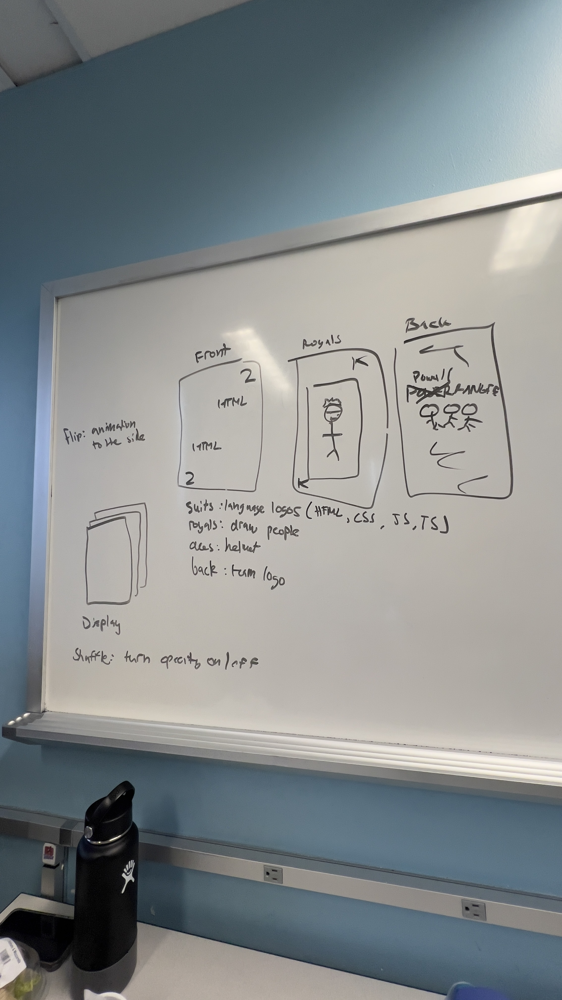
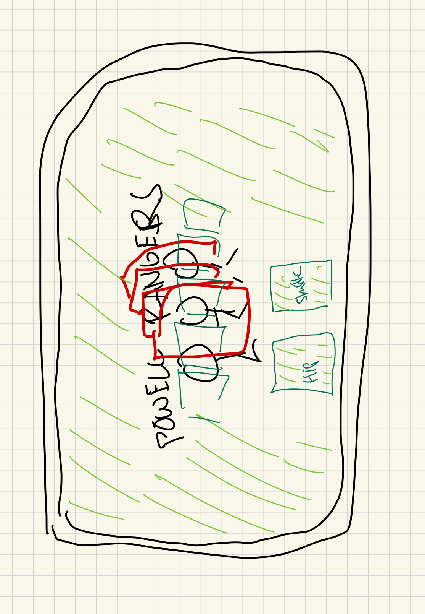

# April 18 notes

## Agenda:
- 10:30am - 6:00pm

## Attendance:
10:30am:
- Nadine
- Minnie

11:00am:
- Austin
- Albert
- Inchul
  
12:00pm:
- Samantha
- Srujam
- Prachi
- Svetlana

12:54pm:
- Skyler

## Notes:
10:30am:
- Discussed flip animation and shuffle animation logistics and design
- Started drafting ideas of what the cards can look like, design wise
- Shuffle animation:
  - Turn on and off opacity quickly of the different cards in the deck
- Flip animation:
  - Only top card gets flipped over
- Card design:
  - Back design - Powell Ranger helmet head (team logo)
  - Suit design - 4 suits, programming language logos on helmet (CSS, JavaScript, HTML, TypeScript)
  - Royals design - members
  - Aces design - helmet
    
11:30am:
- Started working on card deck designs
- Created repository folders and files for backend and frontend
- Create template for webpage in html
  
12:00pm:
- Powell Easter egg
  - Images of Powell hidden (only found through inspect)
  - Joker design - Powell
 
1:00pm:
- Overlaying cards with placeholder cards
- Get shuffle and flip css logic
- Add music to flip and shuffle

1:45pm:
- Creating logic for flipping top card of the deck using a combo of JS and CSS
- Javascript will save the state of the card: flipped or not. if flipped, it will conditionally render the correct CSS.
- Therefore, there will be two types of CSS styling for the top card.

3:30pm:
- Shuffling and flipping has JS/CSS issues
- Prachi branch off trying grid shuffle
- Trying to fix errors with shuffle and flip

## Accomplished/Progress:

## Diagrams

